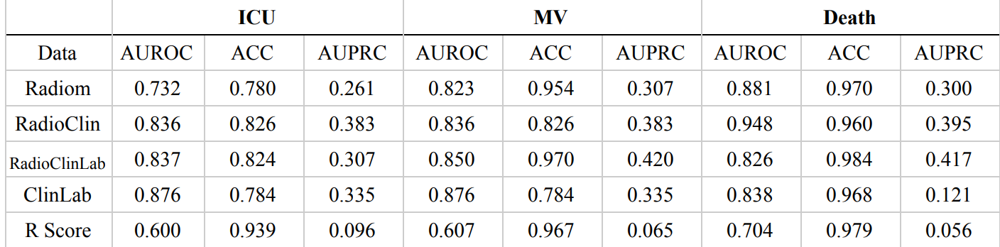

# Introduction 
In order to achieve rapid stratification and timely intensive care of COVID-19 patients, as well as the optimization of medical resource allocation under this unprecedented public health emergency, in this study, prediction models,
which take radiomics based features, are built to predict
high-risk inpatients at the time of admissions.

## Paper Study 
In our study, 3522 NCP inpatients from 39 designated hospitals in China between December 27, 2019, and March 31, 2020 were preliminarily included according to the criteria as follows: 

(a) confirmed positive SARS-CoV-2 nucleic acid test; 

(b) thin-section CT examinations ( > 2.5 mm) and laboratory tests on the dateof admission; 

(c) clear prognosis information was available (discharge, or adverse outcomes including in-hospital death, the admission to intensive care unit [ICU] and requiring mechanical ventilation support [MV]). 

Further, patients were filtered. Exclusion criteria included 

(a) Patients age < 18; 

(b)Patients transferred to other hospitals or remaining hospitalized without any adverse outcomes; 

(c) CT scans without a lung-related convolutional kernel; 

(d) CT scans lack serial information or with motion artifacts or significant resolution reductions. Figure 1 shows the procedure to enroll patients.

The following data were collected and analyzed: 
**(i) Radiomics features (Radiom) 

(ii) Laboratory results (Lab) 

(iii)Clinical features (Clin) 

(iv) Radiologist findings.**

Data Split: 
We split the cohort into two subsets based on the date of admission: cohort 1 (n = 1662) for model development and cohort 2 (n = 700) for the validation and comparison
of models (Figure 1). We constructed radiomics-based
machine learning models for three prediction tasks,
including admission to ICU (positive cases in cohort 1, n
= 96; cohort 2, n = 60), requiring MV (positive cases in
cohort 1, n = 55; cohort 2, n = 39), and in-hospital death
(within 28 days) (positive cases in cohort 1, n = 32; cohort
2, n = 29). In cohort 1 (n=1662), we further splitted the
data into a training set and a test set with a ratio of 7:3.

## Results from Base Paper 
